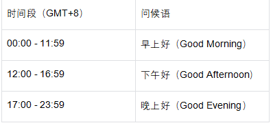

# Smart-Journaling
A simple app to help you journal and keep track of your thoughts.
技术文档实现思考：
1. 创建一个用户实体类，存储用户信息，如用户名、密码、邮箱。
2. 创建一个笔记实体类，存储笔记信息，如标题、内容、创建时间、更新时间、用户ID等。
3. 创建一个笔记服务类，提供笔记的增删改查功能。
4. 创建一个用户服务类，提供用户注册、用户登录的基本功能。
5. 创建一个笔记控制器类，处理用户对笔记的请求。
6. 具备一个存储控制类，用于存储笔记数据，根据用户输入的各项数据，令代码在本地进行一个存储，采用输入流和输出流进行存储，并不连接数据库，存储的格式主要分为两个类型：TXT存储笔记的全部内容，JSON存储笔记的标题、内容、创建时间、更新时间、用户ID等信息。
## 项目实现初步思想：创建一个支持用户在本地进行笔记记录和增删改查的功能。
## 最初实现思路：
    1. 用户操作（登录与退出）在命令行中进行。
    2. 笔记输入（标题， 内容）在命令行中进行，笔记存储在TXT文件中，笔记内容保存在JSON文件中。
    3. 笔记被用户调用的时候，需要读取TXT文件，并解析JSON文件，将笔记内容展示给用户。
    4. 用户在书写笔记的过程中，可以选择按"esc"键保存笔记并且直接退出
    5. 从一个新用户的注册到实现笔记，界面如下，统一在命令行中进行：
        1.开始界面，调用API显示日期